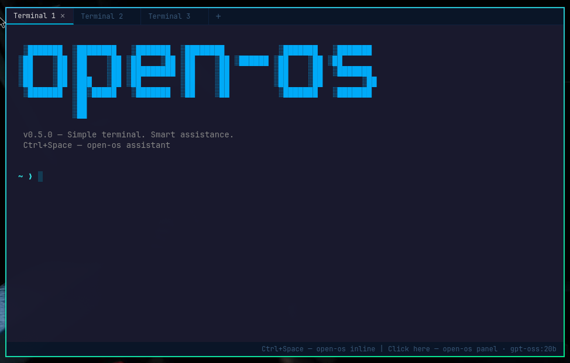
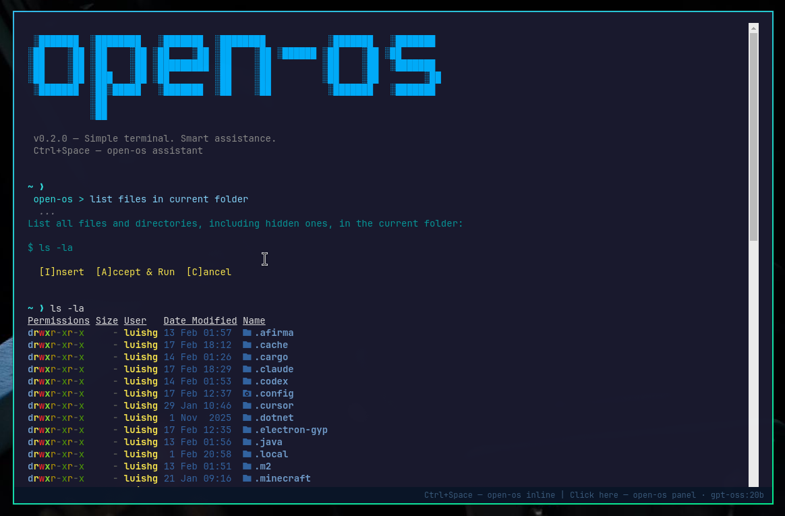

# open-os cli

A small, local-first terminal emulator with optional AI assistance — transparent, safe, and easy to maintain.

Part of **Open-OS** (https://open-os.com/): open, smart tools that make technology more interoperable.





---

## What it is

**open-os cli** is a terminal emulator with integrated AI assistance. It runs your shell normally and adds AI features that are explicit and approval-gated.

- Full terminal emulator (bash/zsh/fish via PTY)
- Two AI interaction modes: **inline** (Ctrl+Space in the terminal) and **panel** (overlay UI)
- Streaming responses from local LLMs via Ollama
- Commands are never executed without explicit user approval
- First-run setup wizard for model selection
- Configuration persisted at `~/.config/open-os-cli/config.json`

---

## Download & install (v0.3.0)

Download from the [GitHub Releases page](https://github.com/luishg/open-os-cli/releases/tag/v0.3.0).

### AppImage (any Linux distro)

| File | Size |
|---|---|
| [`open-os-cli-0.3.0.AppImage`](https://github.com/luishg/open-os-cli/releases/download/v0.3.0/open-os-cli-0.3.0.AppImage) | ~105 MB |

```bash
chmod +x open-os-cli-0.3.0.AppImage
./open-os-cli-0.3.0.AppImage
```

No installation needed. Works on any Linux distro with FUSE support. To integrate with your system launcher, use [AppImageLauncher](https://github.com/TheAssassin/AppImageLauncher) or move it to `~/Applications/` and create a `.desktop` entry.

### Arch Linux (.pacman)

| File | Size |
|---|---|
| [`open-os-cli-0.3.0.pacman`](https://github.com/luishg/open-os-cli/releases/download/v0.3.0/open-os-cli-0.3.0.pacman) | ~73 MB |

```bash
sudo pacman -U open-os-cli-0.3.0.pacman
```

After installing, launch with:

```bash
open-os-cli
```

To uninstall:

```bash
sudo pacman -R open-os-cli
```

### Debian / Ubuntu (.deb)

| File | Size |
|---|---|
| [`open-os-cli_0.3.0_amd64.deb`](https://github.com/luishg/open-os-cli/releases/download/v0.3.0/open-os-cli_0.3.0_amd64.deb) | ~73 MB |

```bash
sudo dpkg -i open-os-cli_0.3.0_amd64.deb
```

After installing, launch with:

```bash
open-os-cli
```

To uninstall:

```bash
sudo dpkg -r open-os-cli
```

### Requirements

- **Ollama** running locally for AI features (`ollama serve`). The terminal works without it — AI features are optional.

---

## Stack

| Layer | Technology | Role |
|---|---|---|
| Window | Electron | Desktop app shell, IPC between processes |
| Terminal | xterm.js + node-pty | Terminal rendering (browser) + real PTY (Node.js) |
| AI | Ollama HTTP API | Local LLM, streaming `/api/chat` |
| Language | TypeScript | Everything |
| Build | esbuild + electron-builder | Bundling + packaging |

---

## Development

### Prerequisites
- **Node.js** 20+
- **Build tools** for native modules (node-pty):
  - Arch Linux: `sudo pacman -S base-devel`
  - Ubuntu/Debian: `sudo apt install build-essential`
- **Ollama** running locally (`ollama serve`)

### Install and start

```bash
git clone <repo-url> open-os-cli
cd open-os-cli
npm install        # installs deps + rebuilds node-pty for Electron
npm start          # builds TypeScript + launches the app
```

### First run
1. The terminal opens with a welcome message
2. Press **Ctrl+Space** — the setup wizard appears if no model is configured
3. Select an Ollama model from the list
4. Start using AI assistance

---

## Usage

### Inline mode (Ctrl+Space)
Press **Ctrl+Space** anywhere in the terminal to enter AI mode:

1. A colored `open-os >` prompt appears
2. Type your question and press Enter
3. The AI response streams directly in the terminal
4. If the AI suggests commands, approval options appear:
   - **[I]nsert** — places the command in the terminal prompt
   - **[A]ccept & Run** — executes the command
   - **[C]ancel** — discards and returns to normal mode

Press Escape at any time to cancel.

### Panel mode (click hint bar)
Click the hint bar at the bottom of the window for an overlay panel:

1. Type your question in the input field
2. The AI response streams in the panel
3. Action buttons appear for suggested commands:
   - **Insert** — writes the command to the terminal
   - **Accept & Run** — executes it
   - **Cancel** — closes the panel

### Context
Both modes automatically capture the last 30 lines of terminal output and include them with your query, giving the AI context about what you're working on. The system prompt also includes your OS, distro, and shell to get platform-specific suggestions.

---

## Architecture

### Data flow

```
User types in xterm.js
        │
        ▼
   [renderer.ts] ───IPC──► [main.ts] ───node-pty──► bash/zsh
                                │                        │
                                │                        ▼
                                │                   shell output
                                │                        │
                            IPC (pty:data) ◄─────────────┘
                                │
                                ▼
                           xterm.js displays output


Ctrl+Space → inline mode / Click → panel mode
User types question → Enter
        │
        ▼
   [renderer.ts] ───IPC──► [main.ts] ───HTTP──► Ollama :11434
                                │                     │
                            IPC (ai:chunk) ◄──────────┘
                                │                (streaming)
                                ▼
                    Response displayed (inline or panel)
                    Approval options appear
                                │
                    ┌───────────┼───────────┐
                    ▼           ▼           ▼
                 [Insert]   [Run]      [Cancel]
                 pty.write  pty.write    close
                 (no \r)   (+ \r)
```

### Key design rule
> The AI layer never talks directly to the PTY. It only produces suggestions. Execution always goes through the approval gate in the renderer.

---

## Project structure

```
open-os-cli/
├── package.json          # deps, version, electron-builder config
├── tsconfig.json         # TypeScript config
├── build.mjs             # esbuild — bundles to dist/
├── build/
│   ├── icon.png          # App icon (1024x1024 source)
│   └── icons/            # Generated sizes (16–512px) for hicolor theme
├── .gitignore
├── src/
│   ├── main.ts           # Electron main: window + PTY + Ollama + config
│   ├── preload.ts        # contextBridge: typed IPC API for renderer
│   └── frontend/
│       ├── index.html    # Layout: terminal + panel + hint bar
│       ├── renderer.ts   # xterm.js, inline AI, panel, response routing
│       └── styles.css    # Electric blue theme, animations
└── README.md
```

### Where each concern lives

| Concern | File |
|---|---|
| Window creation, menus, hotkeys | `main.ts` — `createWindow()` |
| PTY spawn and pipe | `main.ts` — `createPty()` |
| Ollama HTTP streaming | `main.ts` — `queryOllama()` |
| Model listing | `main.ts` — `listOllamaModels()` |
| Config persistence | `main.ts` — `loadConfig()` / `saveConfig()` |
| System info for prompt | `main.ts` — `buildSystemPrompt()` |
| IPC bridge | `preload.ts` — `contextBridge` |
| Terminal rendering | `renderer.ts` — xterm.js setup |
| Inline AI mode | `renderer.ts` — state machine (idle/input/streaming/approval) |
| Panel AI mode | `renderer.ts` — overlay panel with setup wizard |
| Response routing | `renderer.ts` — chunks routed by `aiQuerySource` |
| Welcome message | `renderer.ts` — `showWelcome()` |

---

## Configuration

Settings are stored at `~/.config/open-os-cli/config.json`:

```json
{
  "model": "llama3:latest"
}
```

The model can be changed at any time by clicking the model label in the panel header.

Ollama connection defaults to `localhost:11434`.

---

## Principles
1. **No silent execution** — AI never runs commands without explicit user approval.
2. **Transparency** — AI output is visually distinct from terminal output.
3. **Local-first** — Uses Ollama for fully local inference. No accounts, no telemetry.
4. **Small scope** — Focused terminal + AI assistance. No plugins, no agents, no automation.

---

## Contributing
- Keep PRs small and focused
- Prefer simple solutions
- Avoid adding dependencies unless they reduce maintenance

---

## License
MIT or Apache-2.0, consistent with the Open-OS ecosystem.
